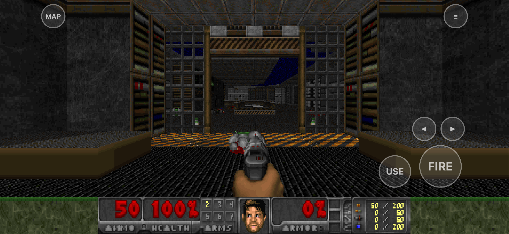
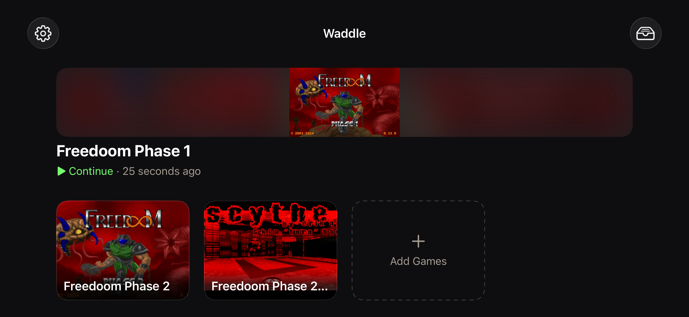

# WADdle

[](https://github.com/tylervick/waddle/actions/workflows/ci.yml)

A free, open-source Doom source-port app for iPhone and iPad, built on
[Woof!](https://github.com/fabiangreffrath/woof) (Boom/MBF21 compatibility).
Bundles [Freedoom](https://freedoom.github.io/) so it plays out of the box;
import your own WADs — commercial IWADs you own, community megawads,
DeHackEd patches — for everything else.

<p>
  
  
</p>

## What WADdle replaces, and the parity bar it answers to

WADdle is the direct successor to the per-game apps of the id/Tom Kidd
DOOM-iOS lineage — DOOM, DOOM II, Final DOOM (TNT + Plutonia in one app) and
SIGIL — replacing that "one app per WAD" model with a single app and a WAD
library ([founding
spec](docs/superpowers/specs/2026-07-11-doom-ios-design.md)). It is meant to
keep those apps' players, so their load-bearing behaviors are the **parity
baseline** this app's UX answers to:

- **Zero-setup launch** — something playable on first open, with no import step.
- **One-tap resume** — the primary button continues the saved game, rather
  than landing on the title screen with menus to walk.
- **Auto-use** — walking into a door or switch operates it; no separate USE tap.
- **A drag-configurable HUD** — on-screen controls repositionable, positions
  persisted.
- **A pan/zoom automap** — drag to pan, pinch to zoom, drop marks.
- **Wavetable MIDI music** — not OPL3 synthesis.

The baseline exists because it changes scope calls. Judged as "is this good
iOS software," touch-layout customization is a nice-to-have — the founding
spec deferred it as exactly that. Judged against the predecessors, it is a
headline feature, because their players already had it.

The 2026-08-13 parity audit measured WADdle against this baseline and filed
every gap it found. This table is that filing record, not a live checklist —
each issue carries its own current state:

| Parity gap | Issue |
| --- | --- |
| Backgrounding mid-game neither pauses nor saves | [#111](https://github.com/tylervick/waddle/issues/111) |
| Resuming a saved game takes the title screen plus four menu steps | [#112](https://github.com/tylervick/waddle/issues/112) |
| Automap can be toggled but never panned, zoomed, or marked | [#113](https://github.com/tylervick/waddle/issues/113) |
| Doors need an explicit USE tap — no auto-use | [#114](https://github.com/tylervick/waddle/issues/114) |
| Touch overlay layout is fixed, with no HUD editor | [#115](https://github.com/tylervick/waddle/issues/115) |
| MIDI music is OPL3-only, not wavetable | [#116](https://github.com/tylervick/waddle/issues/116) |
| Nothing in the repo verifies music or SFX | [#117](https://github.com/tylervick/waddle/issues/117) |
| Library shows raw filenames instead of each game's identity | [#118](https://github.com/tylervick/waddle/issues/118) |
| Documented dead-zone slider range contradicted the code | [#119](https://github.com/tylervick/waddle/issues/119) |

## Working in this repository

`CLAUDE.md` carries the rules that apply to every change. `docs/learnings/`
records the traps this project has already paid for — read
[its index](docs/learnings/INDEX.md) before debugging anything that feels like
it should already work.

## Licensing

WADdle is free software under the **GNU GPL v2** (see [COPYING](COPYING)),
the license of the Woof!/Boom/MBF lineage it descends from. Bundled and
linked components: [Freedoom](https://freedoom.github.io/) data
(BSD-style), [SDL3](https://libsdl.org) (zlib),
[OpenAL Soft](https://openal-soft.org) (LGPL-2.0, conveyed under the GPL),
and [ZIPFoundation](https://github.com/weichsel/ZIPFoundation) (MIT). Full
license texts ship in the app (About screen) and live in
[`App/Resources/Licenses/`](App/Resources/Licenses/), with attribution
notes in
[`App/Resources/Licenses/NOTICES.md`](App/Resources/Licenses/NOTICES.md).
The engine's provenance and the iOS patch set carried on top of upstream
are documented in [`Engine/WOOF_UPSTREAM.md`](Engine/WOOF_UPSTREAM.md).

No commercial game content is included or downloaded — only the freely
licensed Freedoom WADs are bundled. This project is not affiliated with or
endorsed by id Software or Bethesda. The app collects no data of any kind
(see [PRIVACY.md](PRIVACY.md)).

## Building

Requirements: Xcode 26.2+, and the CLI tools `cmake`, `ninja`, and
`xcodegen`. The pinned versions are in `mise.toml` — with
[mise](https://mise.jdx.dev) installed, `mise install` fetches them all;
otherwise `brew install cmake ninja xcodegen` works too (unpinned).

```sh
mise install         # pinned cmake / ninja / xcodegen
mise run bootstrap   # build deps + engine, fetch Freedoom, generate Xcode project
```

Or run the steps individually:

```sh
Scripts/build-deps.sh          # SDL3 + OpenAL Soft static libs (device + simulator)
Scripts/build-engine.sh        # Woof! static lib + WoofEngine.xcframework; stages woof.pk3
Scripts/fetch-freedoom.sh      # Freedoom WADs into App/Resources/GameData
Scripts/generate-build-info.sh # seeds App/Sources/Generated/ (gitignored) so xcodegen's
                                # static file scan picks it up; regenerated every build after
cd App && xcodegen generate    # generate WADdle.xcodeproj
```

Then build/run the `WADdle` scheme in Xcode, or from the command line
(`mise run test` is a shortcut for this):

```sh
xcodebuild -project App/WADdle.xcodeproj -scheme WADdle \
  -destination 'platform=iOS Simulator,name=iPhone 17 Pro' test
```

`test` (not `build`) also runs the engine boot/quit/relaunch smoke check on
the simulator — the fastest way to confirm a from-scratch build actually
works end to end, not just compiles.

TestFlight builds run from CI — dispatch the **TestFlight** workflow
(`gh workflow run testflight.yml --ref main`), or add
`-f validate_only=true` to build, sign and validate without consuming a
build number. The build number is derived automatically; there is nothing to
bump by hand. `Scripts/archive.sh` still produces a Release archive and .ipa
locally as a fallback and is unchanged, but it needs signing credentials for
the configured team and does not manage the build number. Full procedure:
[`docs/app-store/submission-checklist.md`](docs/app-store/submission-checklist.md).

### Deviations worth knowing about

- **The Woof! source is committed (vendored) — do not run
  `Scripts/vendor-woof.sh` as part of a normal build.** It re-downloads the
  pinned upstream tree and clobbers the committed iOS patch set; it exists
  only for maintainers updating the engine pin, following the procedure in
  `Engine/WOOF_UPSTREAM.md`.
- **Woof! is pinned to a `master` commit, not a release tag.**
  `Scripts/vendor-woof.sh` hardcodes `WOOF_COMMIT` to a specific commit on
  the SDL3-based tree (it reports itself as "Woof 15.2.0"). The newer-looking
  `woof_15.3.0` tag is actually the older SDL2-era tree and does not build
  against this project's SDL3-only iOS dependencies. See
  `Engine/WOOF_UPSTREAM.md` for the exact commit, provenance, and the full
  iOS patch set carried on top of it.
- **`woof.pk3` is staged at the app bundle root**
  (`App/Resources/woof.pk3`), *not* under `GameData/` — Woof! locates it via
  `SDL_GetBasePath()`, which resolves to the bundle root on iOS, and there
  is no command-line override for that search. The bundled IWADs
  (`freedoom1.wad`, `freedoom2.wad`, fetched by `Scripts/fetch-freedoom.sh`)
  live under `App/Resources/GameData/` instead and are passed to the engine
  via an explicit `-iwad` path, so their location is unconstrained.
  `App/project.yml`'s folder reference is deliberately named `GameData`
  rather than `Resources`: a literal `Resources` folder reference makes
  Xcode emit macOS-style codesign rules that break `simctl install` on an
  iOS target.
- Engine sessions are launched with `-save <dir>` (not `-savedir`), pointing
  at a per-preset directory (`Documents/Saves/<preset-id>/`) so each
  preset keeps its own save games, even presets that share an IWAD.

## Continuous integration

Two workflows cover the test path, both on GitHub-hosted `macos-26` runners
with the Xcode and simulator versions pinned in each workflow's `env:` block:

| Workflow | Runs when | What it does |
| --- | --- | --- |
| [`ci.yml`](.github/workflows/ci.yml) | Every pull request, and every push to `main` | Build + unit tests |
| [`ui-tests.yml`](.github/workflows/ui-tests.yml) | Manual dispatch only | The UI test suite |

**`ci.yml`** runs the build-script helper tests and
`Scripts/check-substrate.sh` first (they are ~0.1s each and guard the values
the build caches key on), then builds the `WADdle` scheme and tests it with
`-only-testing:WADdleTests`. That filter is required, not a tuning choice: the
scheme's test action also includes `WADdleUITests`, which boot the real engine
and belong to the workflow below. So `mise run test` locally is *broader* than
CI — it runs the whole scheme, UI tests included.

**`ui-tests.yml`** is manual dispatch only
(`gh workflow run ui-tests.yml --ref <branch>`), because a real engine session
in the simulator is the slow, flake-prone half of the suite and is kept off
the pull-request path. It takes two inputs:

- `device` — simulator device name. Default `iPhone 17 Pro`.
- `only_testing` — an optional `-only-testing` filter, e.g.
  `WADdleUITests/EngineSmokeTests`. Leave it blank to run all of
  `WADdleUITests`.

**`WADdleUITests/RealWADTests` never runs in CI**, under either workflow.
`ui-tests.yml` passes `-skip-testing:WADdleUITests/RealWADTests`
unconditionally, so even an explicit `only_testing` dispatch cannot pull it
back in: it needs the non-redistributable WADs in `~/Downloads/doom-test-wads/`,
which no runner has and this repository will never ship. See
[Real-WAD test matrix](#real-wad-test-matrix) for what those tests cover and
how to provision the WADs locally.

**Stale-engine guard.** `Scripts/check-engine-fresh.sh` refuses a
`WoofEngine.xcframework` that does not match the sources that should have
produced it. It compares content, not modification times — the older
`find -newer` behaviour fired on any fresh worktree checkout or restored cache
and demanded a ~25-minute rebuild that changed nothing, so treat any
description of it as an mtime check as out of date. `Scripts/archive.sh` calls
it on the release path; CI runs its tests
(`Scripts/test-check-engine-fresh.sh`) rather than the guard itself, because a
framework restored from cache carries its fingerprint stamp inside the same
cache entry and would pass trivially. It is a staleness guard, not an
integrity guard.

TestFlight builds run from a third workflow, `testflight.yml` — see
[Building](#building) above.

## WAD library

Import WADs three ways: the in-app Import button, "Share → WADdle" from
another app, or drop files into the app's folder in the Files app (adopted
on next launch). IWADs, PWADs, `.deh`/`.bex` patches, and zips containing
any of those all work; zips are recursed into and duplicates are deduped by
content hash. Files that fail to import (bad header, unsupported type,
etc.) are never silently deleted — they're moved to `Documents/Import
Failed/`, visible and recoverable from the Files app. Build **presets**
(one IWAD + ordered PWADs/patches); each preset keeps its own save games.
Freedoom Phase 1+2 are bundled and pre-wired as presets.

## Controls

- **Touch:** left side of the screen is a floating movement stick. On-screen
  buttons: FIRE, USE, weapon prev/next, automap (MAP), and menu (≡). Two
  touch control schemes are available from the gear menu on the Play tab
  ("Touch Controls: Classic / Modern", persisted across launches):
  - **Classic** (default): the stick's horizontal axis turns, vertical axis
    moves forward/back — no strafe, matching how classic WADs expect to be
    played. The right side of the screen has no drag gesture; it only hosts
    buttons.
  - **Modern:** twin-stick strafe — the stick moves in all directions
    (forward/back + strafe), and dragging on the right side turns. The
    right side shows the same base/knob visuals as the movement stick while
    dragging.

  The overlay drives a virtual gamepad, so all bindings are remappable in
  Woof!'s own setup menu.
- **Control feel tuning:** the same gear menu has a "Control Feel…" sheet
  with three persisted sliders (values are read when a session's overlay
  installs, so mid-session changes apply to the next session):
  - **Turn Speed** (0.25–3.0, default 1.0): multiplies the classic scheme's
    stick turn and the modern scheme's drag-to-turn sensitivity.
  - **Stick Dead Zone** (0.0–0.4, default 0.0): *extra* fraction of the
    movement stick's radius to ignore before movement registers, on top of
    the 15% inner dead zone Woof! already applies to gamepad axes
    engine-side.
  - **Move Sensitivity** (0.5–1.5, default 1.0): scales forward/back and
    strafe output.

  With "Show Debug Info" on, the in-session HUD shows the effective values
  (`turn`/`dz`/`move`) — see `docs/manual-testing.md` for the on-device
  tuning procedure.
- **Controllers:** Xbox/PlayStation/Switch/MFi via GameController — the
  touch overlay hides automatically while one is connected.
- **Keyboard & mouse:** hardware keyboards hide the overlay; mouse look
  works on iPad (indirect input events are enabled).
- **Debug HUD:** the same gear menu has a "Show Debug Info" toggle
  (persisted) that adds a build-stamp footer on the Play tab and a live
  commit/scheme/touch-event/trigger-value overlay during engine sessions —
  see `docs/manual-testing.md` for what each field means.

### Real-WAD test matrix

`App/UITests/RealWADTests.swift` verifies vanilla/Boom/MBF21 content against
real community WADs, plus a negative case built from a synthetic,
unrecognized-IWAD fixture that `Scripts/provision-test-wads.sh` generates
itself — not a real wrong-IWAD-pairing WAD. (Woof never auto-warps into a
level without an explicit `-warp` flag, which this app never passes, so a
real mismatched IWAD/PWAD pairing just idles harmlessly on the title screen
instead of erroring; an unrecognized IWAD is the reliable way to make the
engine actually fail.) The vanilla/Boom/MBF21 cases expect the real WADs in
`~/Downloads/doom-test-wads/` (see the script header) provisioned via
`Scripts/provision-test-wads.sh` after installing the app on the simulator;
without them, only that test class fails.
